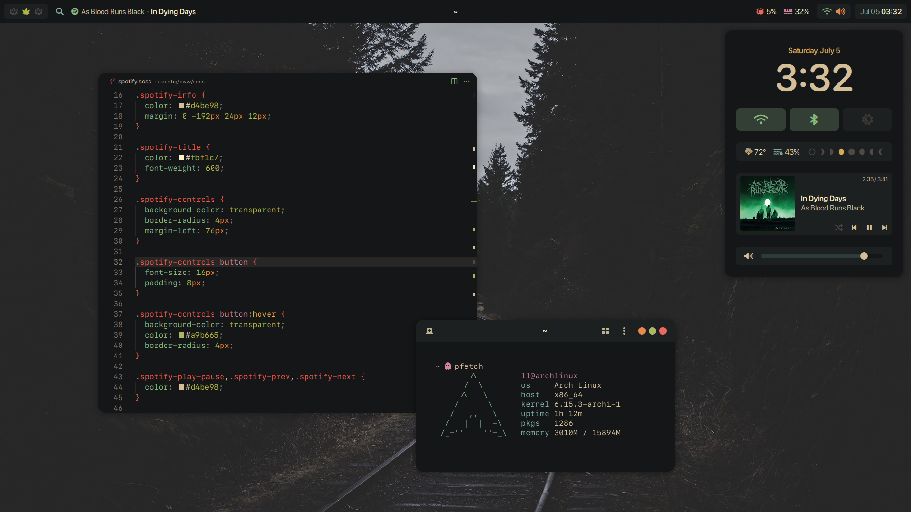

## Themes, Icons & Fonts

- [Gruvbox GTK Theme](https://github.com/Fausto-Korpsvart/Gruvbox-GTK-Theme)
- [Gruvbox Material for VSCode](https://github.com/sainnhe/gruvbox-material-vscode)
- [Gruvbox Papirus Folders](https://github.com/xelser/gruvbox-papirus-folders)
- [Papirus Icon Theme](https://github.com/PapirusDevelopmentTeam/papirus-icon-theme)
- [SF Pro Rounded](https://aur.archlinux.org/packages/apple-fonts)
- [SFMono Nerd Font](https://github.com/shaunsingh/SFMono-Nerd-Font-Ligaturized)
- [Font Awesome](https://fontawesome.com/)

## Tools & Widgets

- [Niri](https://github.com/YaLTeR/niri) - A scrollable-tiling Wayland compositor
- [Waybar](https://github.com/Alexays/Waybar) - Highly customizable Wayland bar for Sway and Wlroots based compositors
- [Eww](https://github.com/elkowar/eww) - ElKowars wacky widgets
- [Dunst](https://github.com/dunst-project/dunst) - Lightweight and customizable notification daemon
- [Ghostty](https://github.com/ghostty-org/ghostty) - Ghostty is a fast, feature-rich, and cross-platform terminal emulator that uses platform-native UI and GPU acceleration
- [Fish](https://github.com/fish-shell/fish-shell) - The user-friendly command line shell
- [Starship](https://github.com/starship/starship) - The minimal, blazing-fast, and infinitely customizable prompt for any shell!
- [Fuzzel](https://codeberg.org/dnkl/fuzzel) - App launcher and fuzzy finder for Wayland, inspired by rofi and dmenu
- [swww](https://github.com/LGFae/swww) - A Solution to your Wayland Wallpaper Woes
- [Spicetify](https://github.com/spicetify/cli) - Command-line tool to customize Spotify client
